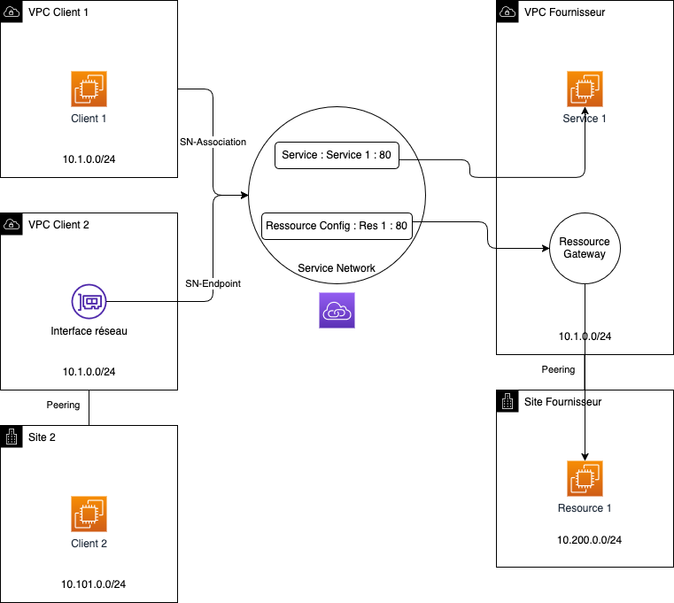

# DemoLattice - AWS VPC Lattice Demo Project

> [!WARNING]  
> ## ⚠️ Important Disclaimer
>
> **This project is for testing and demonstration purposes only.**
>
> Please be aware of the following:
>
> - The infrastructure deployed by this project is not intended for production use.
> - Security measures may not be comprehensive or up to date.
> - Performance and reliability have not been thoroughly tested at scale.
> - The project may not comply with all best practices or organizational standards.
>
> Before using any part of this project in a production environment:
>
> 1. Thoroughly review and understand all code and configurations.
> 2. Conduct a comprehensive security audit.
> 3. Test extensively in a safe, isolated environment.
> 4. Adapt and modify the code to meet your specific requirements and security standards.
> 5. Ensure compliance with your organization's policies and any relevant regulations.
>
> The maintainers of this project are not responsible for any issues that may arise from the use of this code in production environments.
---

This project demonstrates the implementation and usage of AWS VPC Lattice for service networking across multiple VPCs. It provides both Terraform and AWS CDK implementations to showcase different infrastructure-as-code approaches.

## Architecture Diagram



## Project Overview

DemoLattice creates a multi-VPC architecture to demonstrate AWS VPC Lattice capabilities:

- **Service Discovery**: Connect services across multiple VPCs
- **Traffic Management**: Route traffic between services
- **Security Controls**: Implement access controls for service-to-service communication
- **Observability**: Monitor service network traffic

## Test Scenario

This project specifically tests the following scenarios:

- **Overlapping CIDR Blocks**: Client1, Client2, and Provider VPCs intentionally use the same CIDR block (10.1.0.0/24) to demonstrate VPC Lattice's ability to handle overlapping IP address spaces.

- **On-Premises Connectivity Simulation**: 
  - Client2Bis VPC simulates an on-premises environment connected to Client2 VPC through VPC Peering.
  - ProviderBis VPC simulates an on-premises service connected to Provider VPC through VPC Peering.

- **Hybrid Service Access**: The Provider offers two services:
  - A service running in AWS (Provider VPC)
  - A service running in the simulated on-premises environment (ProviderBis VPC)

## Architecture

The project sets up the following infrastructure:

- **Client VPCs**: 
  - Client1 VPC (10.1.0.0/24)
  - Client2 VPC (10.1.0.0/24)
  - Client2Bis VPC (10.101.0.0/24) - Simulates on-premises environment

- **Provider VPCs**:
  - Provider VPC (10.1.0.0/24)
  - ProviderBis VPC (10.200.0.0/24) - Simulates on-premises service

- **VPC Peering Connections**:
  - Between Provider and ProviderBis VPCs
  - Between Client2 and Client2Bis VPCs

- **VPC Lattice Components**:
  - Service Network
  - Service with HTTP listener
  - Target Group with Provider instance
  - Resource Gateway for ProviderBis instance
  - VPC associations with the Service Network

- **EC2 Instances**:
  - Client instances for testing connectivity
  - Provider instances running web servers that display connection information

## Implementation Options

### Terraform Implementation

The Terraform implementation is located in the `/terraform` directory and uses Terraform to provision all resources.

```bash
cd terraform
terraform init
terraform plan
terraform apply
```

### AWS CDK Implementation

The CDK implementation is located in the `/cdk` directory and uses AWS CDK with TypeScript.

```bash
cd cdk
npm install
npm run build
cdk deploy
```

## Prerequisites

- AWS Account with appropriate permissions
- AWS CLI configured with credentials
- Terraform (v1.0.0+) for the Terraform implementation
- Node.js (v14.x+) and AWS CDK CLI for the CDK implementation

## Testing the Setup

After deployment, you can test the VPC Lattice setup using different access methods:

### From Client1 VPC

Client1 VPC is directly associated with the Service Network, so you can access both services using the VPC Lattice service FQDN:

```bash
# Connect to Client1 instance using AWS Systems Manager Session Manager
aws ssm start-session --target <client1-instance-id>

# Access the AWS service
curl http://service1.<generated-id>.vpc-lattice-svcs.<region>.amazonaws.com

# Access the simulated on-premises service (via Resource Gateway)
curl http://service1.<generated-id>.vpc-lattice-svcs.<region>.amazonaws.com
```

### From Client2 VPC

Client2 VPC uses a VPC Endpoint to connect to the Service Network, so you must access services through the Service Network Endpoint FQDN:

```bash
# Connect to Client2 instance using AWS Systems Manager Session Manager
aws ssm start-session --target <client2-instance-id>

# Access services through the Service Network Endpoint
curl http://<service-network-endpoint-dns-name>
```

### From Client2Bis VPC (Simulated On-Premises)

Client2Bis VPC is connected to Client2 VPC via VPC Peering, demonstrating how on-premises environments can access VPC Lattice services:

```bash
# Connect to Client2Bis instance using AWS Systems Manager Session Manager
aws ssm start-session --target <client2bis-instance-id>

# Access services through Client2's VPC Endpoint (via VPC Peering)
curl http://<service-network-endpoint-dns-name>
```

The web servers will display connection information including:
- Server IP
- Client IP
- VPC Lattice headers
- Connection path information

## Security Features

- Private networking with no internet exposure for services
- AWS Systems Manager Session Manager for secure instance access
- VPC endpoints for AWS services to avoid internet traffic

## Cleanup

To avoid incurring charges, remember to destroy the resources when done:

### Terraform
```bash
cd terraform
terraform destroy
```

### CDK
```bash
cd cdk
cdk destroy
```

## Project Structure

- `/terraform` - Terraform implementation files
- `/cdk` - AWS CDK implementation files
- `/img` - Architecture diagrams and images

## Contributing

Contributions to improve the demo are welcome. Please feel free to submit pull requests or open issues for any improvements or bug fixes.

## License

This project is licensed under the MIT License - see the LICENSE file for details.