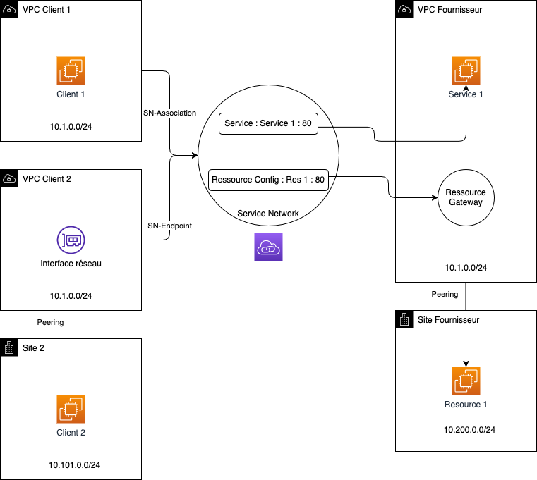

# DemoLattice - AWS CDK Implementation

> [!WARNING]  
> ## ⚠️ Important Disclaimer
>
> **This project is for testing and demonstration purposes only.**
>
> Please be aware of the following:
>
> - The infrastructure deployed by this project is not intended for production use.
> - Security measures may not be comprehensive or up to date.
> - Performance and reliability have not been thoroughly tested at scale.
> - The project may not comply with all best practices or organizational standards.
>
> Before using any part of this project in a production environment:
>
> 1. Thoroughly review and understand all code and configurations.
> 2. Conduct a comprehensive security audit.
> 3. Test extensively in a safe, isolated environment.
> 4. Adapt and modify the code to meet your specific requirements and security standards.
> 5. Ensure compliance with your organization's policies and any relevant regulations.
>
> The maintainers of this project are not responsible for any issues that may arise from the use of this code in production environments.
---

This directory contains the AWS CDK implementation of the DemoLattice project, which demonstrates AWS VPC Lattice for service networking across multiple VPCs.

## Architecture Diagram



## Architecture Overview

The CDK code provisions the following resources:

- **VPCs**:
  - Client1 VPC (10.1.0.0/24)
  - Client2 VPC (10.1.0.0/24)
  - Client2Bis VPC (10.101.0.0/24)
  - Provider VPC (10.1.0.0/24)
  - ProviderBis VPC (10.200.0.0/24)

- **VPC Peering**:
  - Provider to ProviderBis
  - Client2 to Client2Bis

- **EC2 Instances**:
  - Client instances in Client1 and Client2Bis VPCs
  - Provider instances with web servers in Provider and ProviderBis VPCs

- **VPC Lattice Components**:
  - Service Network
  - Service with HTTP listener
  - Target Group for Provider instance
  - Resource Gateway for ProviderBis instance

## Prerequisites

- AWS Account with appropriate permissions
- Node.js (v14.x or later)
- AWS CDK CLI (`npm install -g aws-cdk`)
- AWS CLI configured with appropriate credentials

## Configuration

### 1. Install Dependencies

First, install the required npm packages:

```bash
npm install
```

### 2. CIDR Block Configuration

**Important Note**: The current configuration intentionally uses overlapping CIDR blocks (10.1.0.0/24) for Client1, Client2, and Provider VPCs. This is by design for this demo to showcase specific networking scenarios with VPC Lattice. **Do not modify these CIDR blocks** as it may break the intended demonstration.

The CIDR blocks are:
- Client1 VPC: 10.1.0.0/24
- Client2 VPC: 10.1.0.0/24
- Client2Bis VPC: 10.101.0.0/24
- Provider VPC: 10.1.0.0/24
- ProviderBis VPC: 10.200.0.0/24

### 3. AWS Account and Region Configuration

Configure the AWS account and region in `bin/vpc-lattice-cdk.ts`:

```typescript
// In bin/vpc-lattice-cdk.ts
const app = new cdk.App();
new VpcLatticeStack(app, 'VpcLatticeStack', {
  env: { 
    account: process.env.CDK_DEFAULT_ACCOUNT, 
    region: process.env.CDK_DEFAULT_REGION 
  }
});
```

You can also hardcode your account and region if preferred:

```typescript
env: { 
  account: '123456789012', 
  region: 'us-east-1' 
}
```

### 4. Instance Configuration

Review and adjust the EC2 instance configurations in `lib/vpc-lattice-stack.ts` if needed:

```typescript
// Example: Change instance type
instanceType: ec2.InstanceType.of(ec2.InstanceClass.T3A, ec2.InstanceSize.MICRO),
```

## Deployment Instructions

### 1. Build the TypeScript Code

```bash
npm run build
```

### 2. Synthesize the CloudFormation Template (Optional)

```bash
cdk synth
```

This will generate the CloudFormation template without deploying it, allowing you to review the resources that will be created.

### 3. Deploy the Stack

```bash
cdk deploy
```

To deploy to a specific AWS account and region:

```bash
cdk deploy --profile [profile_name]
```

### 4. View Outputs

After deployment, CDK will output important information such as:
- VPC IDs
- Service DNS name

## Testing the Setup

After deployment:

1. Connect to the client instances using AWS Systems Manager Session Manager
2. Test connectivity to the VPC Lattice service:

```bash
# From a Client instance
curl http://<Service1DnsName>
```

The web server will display connection information including:
- Server IP
- Client IP
- VPC Lattice headers

## Troubleshooting

### Common Issues

1. **Deployment Failures**:
   - Check that your AWS credentials have sufficient permissions
   - Verify that the specified region supports all required services
   - Look for errors in the CloudFormation events

2. **TypeScript Compilation Errors**:
   - Run `npm run build` to check for compilation errors
   - Ensure all imports are correct

3. **Resource Limits**:
   - You might hit service limits for VPCs, endpoints, or other resources
   - Request limit increases if needed

## Cleanup

To avoid incurring charges, destroy all resources when done:

```bash
cdk destroy
```

## File Structure

- `bin/vpc-lattice-cdk.ts` - Entry point for the CDK app
- `lib/vpc-lattice-stack.ts` - Main stack definition
- `package.json` - Project dependencies and scripts
- `tsconfig.json` - TypeScript configuration
- `cdk.json` - CDK configuration

## Customization

To customize this implementation:

1. Adjust instance types or AMIs in the EC2 instance resources
2. Add additional services or target groups to the VPC Lattice setup
3. Extend security groups for more granular access control

**Note**: Do not modify the CIDR ranges as they are intentionally configured for this demo.